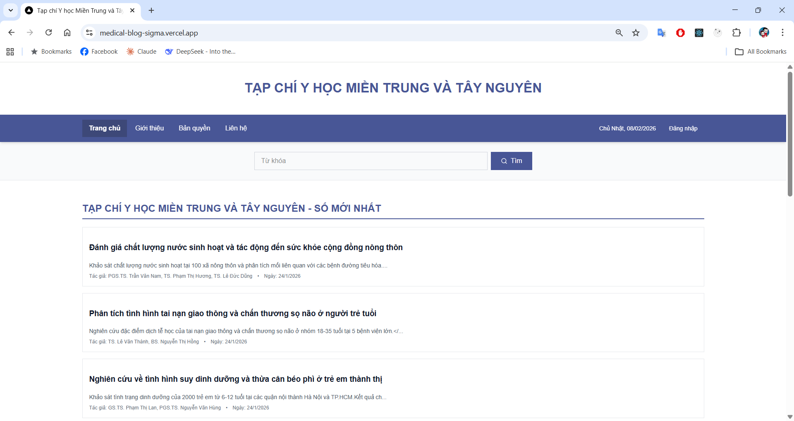
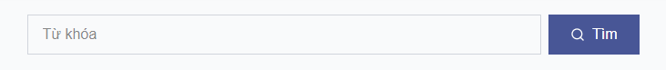

# HƯỚNG DẪN SỬ DỤNG  
## TRANG CHỦ – TẠP CHÍ Y HỌC MIỀN TRUNG VÀ TÂY NGUYÊN

---

## 1. Giới thiệu

**Trang chủ** là màn hình đầu tiên khi truy cập website  
**Tạp chí Y học Miền Trung và Tây Nguyên**.

Từ Trang chủ, người dùng có thể:
- Xem các bài viết y học mới nhất
- Tìm kiếm bài viết theo từ khóa
- Truy cập các trang Giới thiệu, Liên hệ
- Đăng nhập (nếu có tài khoản)

---

## 2. Giao diện tổng quan Trang chủ

Hình trên là giao diện toàn bộ Trang chủ của website.  
Các khu vực quan trọng sẽ được giải thích chi tiết bên dưới.

---

## 3. Thanh menu điều hướng

Thanh menu nằm ở phía trên cùng của Trang chủ, bao gồm các mục:

- **Trang chủ**: Quay về màn hình chính
- **Giới thiệu**: Xem thông tin về tạp chí
- **Bản quyền**: Xem thông tin bản quyền nội dung
- **Liên hệ**: Xem thông tin liên hệ
- **Đăng nhập**: Dành cho người có tài khoản quản trị

Ở góc phải hiển thị:
- **Ngày hiện tại**: Giúp người dùng biết thời gian truy cập

👉 Người dùng chỉ cần nhấn chuột vào từng mục để chuyển trang.

---

## 4. Khu vực tìm kiếm và bài viết

### 4.1 Ô tìm kiếm bài viết

- Ô **“Từ khóa”**: Nhập nội dung cần tìm  
- Nút **“Tìm”**: Thực hiện tìm kiếm

**Ví dụ từ khóa:**
- nước sinh hoạt
- dinh dưỡng
- tai nạn giao thông

👉 Nên nhập từ khóa ngắn để kết quả chính xác hơn.

---

### 4.2 Danh sách bài viết mới nhất

Ngay bên dưới ô tìm kiếm là danh sách các bài viết mới.

Mỗi bài viết hiển thị:
- **Tiêu đề bài viết**
- **Mô tả ngắn nội dung**
- **Tên tác giả**
- **Ngày đăng**

👉 Nhấn vào **tiêu đề bài viết** để xem nội dung chi tiết.

---

## 5. Các thao tác thường dùng từ Trang chủ

Từ Trang chủ, người dùng có thể:
- Đọc bài viết → nhấn vào tiêu đề bài viết
- Tìm bài viết → dùng ô tìm kiếm
- Xem thông tin tạp chí → nhấn **Giới thiệu**
- Liên hệ hỗ trợ → nhấn **Liên hệ**

---

## 6. Lưu ý khi sử dụng

- Không cần đăng nhập để đọc bài viết
- Nếu không tìm thấy bài viết:
  - Kiểm tra lại từ khóa
  - Thử từ khóa khác ngắn hơn
- Trang web phù hợp sử dụng trên máy tính và laptop

---

📌 **File tiếp theo cần xem:**  
➡️ `01-xem-bai-viet.md` – Hướng dẫn đọc chi tiết một bài viết
