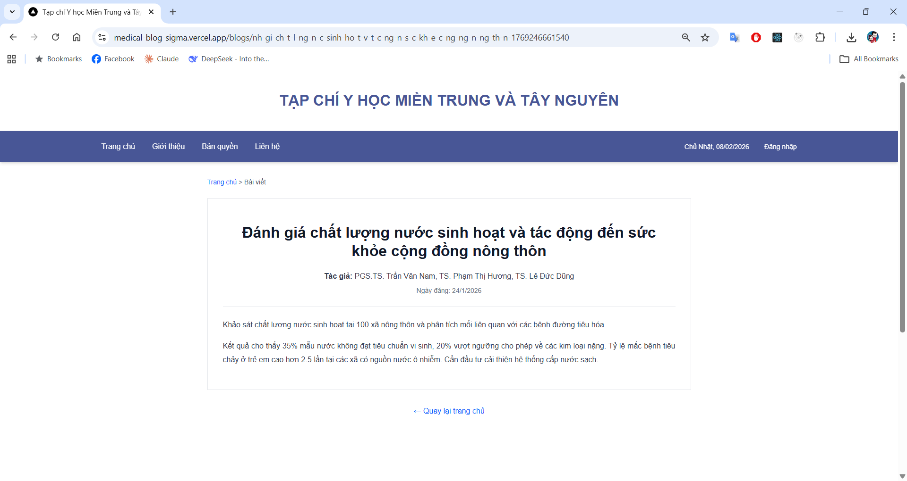
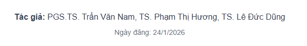

# HƯỚNG DẪN XEM CHI TIẾT BÀI VIẾT

---

## 1. Giới thiệu

Chức năng **Xem chi tiết bài viết** cho phép người dùng đọc đầy đủ nội dung
của một bài viết y học được đăng trên website.

Mọi thao tác đều bắt đầu từ **Trang chủ**.

---

## 2. Cách mở một bài viết

### Bước 1: Truy cập Trang chủ
- Khi vào website, màn hình đầu tiên là **Trang chủ**
- Trang chủ hiển thị danh sách các bài viết mới nhất

### Bước 2: Chọn bài viết cần đọc
- Tìm bài viết bạn quan tâm
- **Nhấn chuột vào tiêu đề bài viết**

👉 Trang web sẽ tự động chuyển sang trang chi tiết bài viết.

---

## 3. Giao diện trang chi tiết bài viết

Hình trên là giao diện đầy đủ của trang chi tiết một bài viết.

---

## 4. Thông tin ở phần đầu bài viết

Phần đầu của bài viết bao gồm:

- **Tiêu đề bài viết**  
  Cho biết nội dung chính của bài viết

- **Tác giả**  
  Danh sách các tác giả thực hiện nghiên cứu

- **Ngày đăng**  
  Thời điểm bài viết được đăng tải trên website

👉 Các thông tin này giúp người đọc:
- Biết nguồn bài viết
- Đánh giá độ mới của nội dung

---

## 5. Nội dung bài viết

Ngay bên dưới phần tiêu đề là **nội dung chi tiết của bài viết**.

Nội dung thường bao gồm:
- Mô tả nghiên cứu
- Kết quả chính
- Nhận định và kết luận

👉 Người dùng chỉ cần **cuộn chuột xuống** để đọc toàn bộ nội dung.

---

## 6. Quay lại Trang chủ

Sau khi đọc xong bài viết, người dùng có thể quay lại Trang chủ bằng cách:

- Nhấn vào liên kết **“← Quay lại trang chủ”** ở cuối trang  
**hoặc**
- Nhấn vào **Trang chủ** trên thanh menu phía trên

---

## 7. Lưu ý khi đọc bài viết

- Không cần đăng nhập để đọc bài viết
- Nếu chữ quá nhỏ:
  - Có thể phóng to trình duyệt (Ctrl + +)
- Nên đọc trên máy tính hoặc laptop để hiển thị rõ ràng hơn

---

📌 **File tiếp theo cần xem:**  
➡️ `02-tim-kiem-bai-viet.md` – Hướng dẫn tìm kiếm bài viết theo từ khóa
