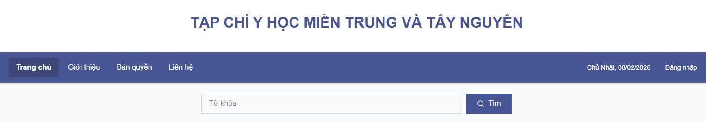
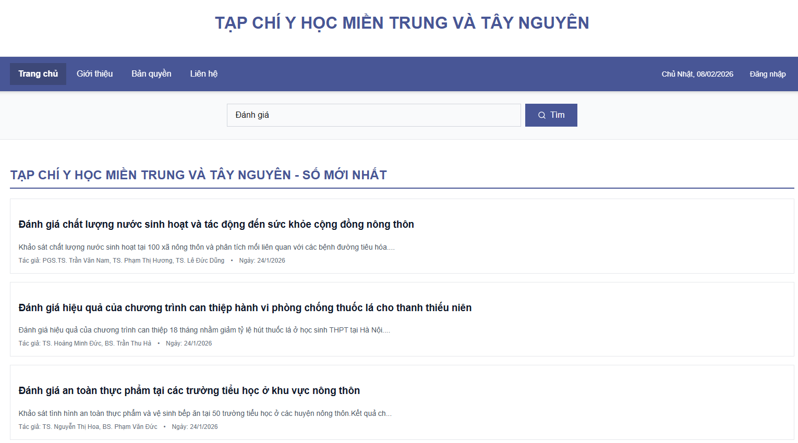

# 02. Tìm kiếm và xem bài viết

## 1. Mục đích
Chức năng **Tìm kiếm và xem bài viết** cho phép người dùng:
- Tìm kiếm bài viết theo **từ khóa**
- Xem **danh sách bài viết** phù hợp
- Truy cập vào **chi tiết nội dung bài viết**

Chức năng này giúp người đọc nhanh chóng tiếp cận các bài báo khoa học mong muốn.

---

## 2. Giao diện trang chủ và tìm kiếm bài viết

### Mô tả:
- Thanh menu trên cùng gồm:
  - Trang chủ
  - Giới thiệu
  - Bản quyền
  - Liên hệ
- Thanh tìm kiếm:
  - Người dùng nhập **từ khóa** (ví dụ: *Đánh giá*)
  - Nhấn nút **Tìm** để thực hiện tìm kiếm
- Kết quả tìm kiếm hiển thị dưới dạng **danh sách bài viết**, mỗi bài gồm:
  - Tiêu đề bài viết
  - Mô tả ngắn nội dung
  - Tác giả
  - Ngày đăng

---

## 3. Xem chi tiết bài viết

### Mô tả:
Khi người dùng nhấn vào tiêu đề bài viết, hệ thống hiển thị trang chi tiết gồm:
- **Tiêu đề bài viết**
- **Thông tin tác giả**
- **Ngày đăng**
- **Nội dung bài viết**

Trang chi tiết giúp người đọc theo dõi đầy đủ nội dung nghiên cứu khoa học.

---

## 4. Điều hướng
- Người dùng có thể nhấn **“← Quay lại trang chủ”** để trở về danh sách bài viết
- Thanh menu luôn hiển thị để điều hướng sang các chức năng khác

---

## 5. Kết luận
Chức năng tìm kiếm và xem bài viết:
- Giúp người dùng dễ dàng tra cứu bài báo
- Giao diện đơn giản, dễ sử dụng
- Phù hợp với mọi đối tượng độc giả
