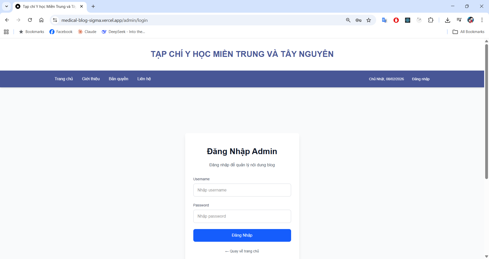

# 03. Đăng nhập hệ thống quản trị

## 1. Mục đích
Chức năng **Đăng nhập Admin** cho phép người quản trị truy cập vào hệ thống để:
- Quản lý nội dung bài viết
- Thực hiện các thao tác quản trị hệ thống

> Chức năng này **chỉ dành cho quản trị viên**, người dùng thông thường không cần sử dụng.

---

## 2. Đường dẫn truy cập
Người quản trị truy cập vào trang đăng nhập theo đường dẫn:

https://medical-blog-sigma.vercel.app/admin/login

---

## 3. Giao diện đăng nhập

### Mô tả giao diện:
Trang đăng nhập gồm các thành phần chính:
- **Username**: Tên đăng nhập của quản trị viên
- **Password**: Mật khẩu tương ứng
- **Nút “Đăng Nhập”**: Thực hiện đăng nhập vào hệ thống
- **Liên kết “Quay về trang chủ”**: Trở lại trang web dành cho người dùng

---

## 4. Cách đăng nhập

### Bước 1
Nhập **Username** được cấp vào ô *Username*

### Bước 2
Nhập **Password** vào ô *Password*

### Bước 3
Nhấn nút **Đăng Nhập**

- Nếu thông tin hợp lệ, hệ thống sẽ chuyển sang **trang quản trị**
- Nếu thông tin không đúng, hệ thống sẽ yêu cầu nhập lại

---

## 5. Lưu ý
- Không chia sẻ tài khoản quản trị cho người không có trách nhiệm
- Nên đăng xuất sau khi sử dụng xong trên máy tính công cộng
- Nếu quên mật khẩu, liên hệ quản trị hệ thống để được hỗ trợ

---

## 6. Kết luận
Chức năng đăng nhập giúp đảm bảo:
- Chỉ người có quyền mới được quản lý nội dung
- Tăng tính bảo mật cho hệ thống
