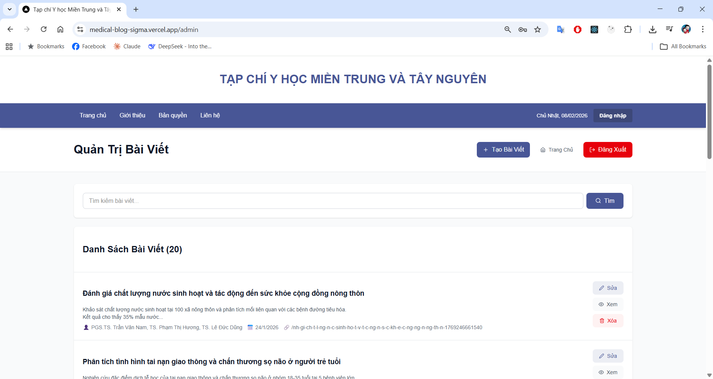

# 04. Quản trị bài viết (Tạo – Sửa – Xóa – Xem)

## 1. Giới thiệu
Sau khi đăng nhập thành công, người quản trị sẽ được chuyển đến **trang Quản trị bài viết**.  
Tại đây, quản trị viên có thể:
- Tạo bài viết mới
- Chỉnh sửa bài viết đã có
- Xem nội dung bài viết
- Xóa bài viết không còn sử dụng

---

## 2. Giao diện quản trị bài viết

### Các thành phần chính trên màn hình:
1. **Nút “+ Tạo bài viết”**  
   → Dùng để tạo bài viết mới

2. **Ô tìm kiếm bài viết**  
   → Nhập từ khóa để tìm nhanh bài viết theo tiêu đề

3. **Danh sách bài viết**  
   Mỗi bài viết hiển thị:
   - Tiêu đề bài viết
   - Mô tả ngắn
   - Tác giả
   - Ngày đăng

4. **Các nút thao tác bên phải mỗi bài viết**
   - **Sửa**: chỉnh sửa nội dung bài viết
   - **Xem**: xem chi tiết bài viết
   - **Xóa**: xóa bài viết khỏi hệ thống

---

## 3. Tạo bài viết mới

### Cách thực hiện:
1. Nhấn nút **“+ Tạo bài viết”**
2. Nhập đầy đủ thông tin bài viết (tiêu đề, nội dung, tác giả…)
3. Nhấn nút **Lưu** để hoàn tất

> 📌 Chức năng này dùng khi cần đăng bài viết mới lên hệ thống.

📷 *Hình ảnh minh họa sẽ được cập nhật*

---

## 4. Sửa bài viết

### Cách thực hiện:
1. Tại danh sách bài viết, nhấn nút **“Sửa”** tương ứng với bài viết cần chỉnh sửa
2. Cập nhật lại nội dung mong muốn
3. Nhấn **Lưu** để ghi nhận thay đổi

> 📌 Dùng khi cần chỉnh sửa lỗi nội dung hoặc cập nhật thông tin bài viết.

📷 *Hình ảnh minh họa sẽ được cập nhật*

---

## 5. Xem bài viết

### Cách thực hiện:
1. Nhấn nút **“Xem”** tại bài viết cần kiểm tra
2. Hệ thống hiển thị nội dung chi tiết bài viết

> 📌 Giúp kiểm tra nội dung trước khi công bố hoặc
